<div align="center">

<picture>
  <source media="(prefers-color-scheme: dark)" srcset="soundcreations/assets/img/logo-white.png">
  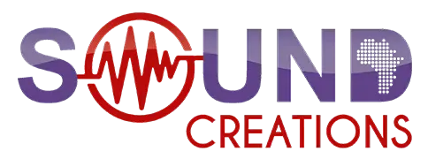
</picture>

# Sound Creations Ltd Rwanda

### Independent WordPress platform for [soundcreationsltd.rw](https://soundcreationsltd.rw/)

Authorised **Yamaha** distributor and **FANE Africa** partner in Kigali. Professional audio, lighting, acoustics and AV integration for venues, churches, schools, government and hospitality across Rwanda, the DRC and East Africa.

\
\
\
\
\
\
\
\
\
\

[Live site](https://soundcreationsltd.rw/) · [Yamaha Rwanda](https://soundcreationsltd.rw/yamaha/) · [FANE Africa](https://soundcreationsltd.rw/fane/) · [Projects](https://soundcreationsltd.rw/projects/) · [Products](https://soundcreationsltd.rw/products/) · [Request a consultation](https://soundcreationsltd.rw/request-a-consultation/) · [Group site (Kenya)](https://soundcreationsltd.com/)

</div>

---

\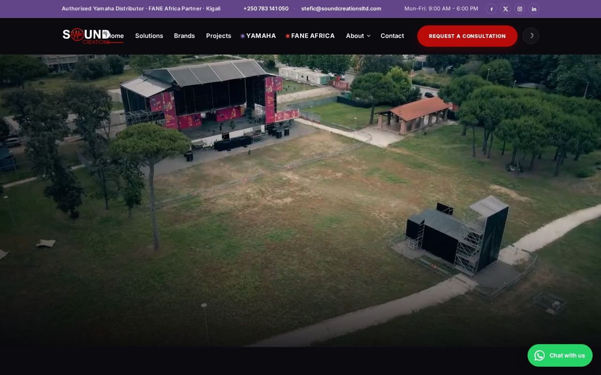

## Contents

- [Overview](#overview)
- [Screenshots](#screenshots)
- [What the site delivers](#what-the-site-delivers)
- [Architecture](#architecture)
- [Project structure](#project-structure)
- [Content model](#content-model)
- [SEO and structured data](#seo-and-structured-data)
- [Performance and security](#performance-and-security)
- [Requirements](#requirements)
- [Deployment](#deployment)
- [Editing pages with Elementor](#editing-pages-with-elementor)
- [Still needed from the Rwanda team](#still-needed-from-the-rwanda-team)
- [Business](#business)

## Overview

Sound Creations Ltd Rwanda is the Kigali arm of the Sound Creations group, founded in Nairobi in 1989. The Rwanda office asked for an **independent website** rather than a section of the Kenya site, so this is a separate WordPress install on its own domain and hosting, with its own database, admin, content, enquiries and analytics.

It runs a **copy of the group code** from [soundcreationsltd.com](https://soundcreationsltd.com/) so both sites read as one brand, with a Rwanda-only child theme layered on top for local business details, content, products, projects and SEO.

| Package | Folder | Version | Role |
| --- | --- | --- | --- |
| **Sound Creations** (parent theme) | [`soundcreations/`](soundcreations) | 0.10.11 | Group design system: dark-first editorial layout, templates for solutions, services, projects, brands, products and resources |
| **Sound Creations Rwanda** (child theme) | [`soundcreations-rwanda/`](soundcreations-rwanda) | 1.1.0 | **Activate this one.** Rwanda contacts, hours, pages, Yamaha and FANE hubs, 55-product catalogue, Rwanda projects, clients, local SEO, analytics and Elementor widgets |
| **Sound Creations Core** (plugin) | [`sound-creations-core/`](sound-creations-core) | 0.5.25 | Content types, taxonomies, central business-settings store, schema graph and starter setup. Lives in a plugin so data survives a theme change |
| **Sound Creations Enquiries** (plugin) | [`sound-creations-enquiries/`](sound-creations-enquiries) | 0.2.0 | B2B enquiry system: consultation, quote, product, dealer, FANE and support forms with routing, secure storage, email alerts and spam scoring |
| **Server rules** | [`server/`](server) | - | `.htaccess` compression and browser-caching block for LiteSpeed / Apache |

> The theme controls how the site looks. The plugins hold the business data (products, projects, brands, enquiries, settings), so that data stays safe when the theme is updated or replaced.

## Screenshots

### Desktop

| Yamaha Rwanda hub | FANE Africa partner page |
| --- | --- |
| \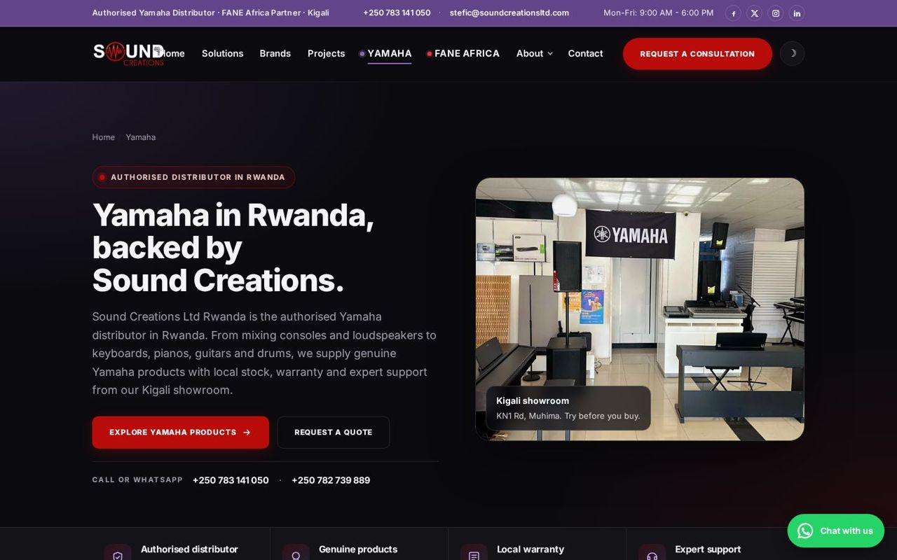 | \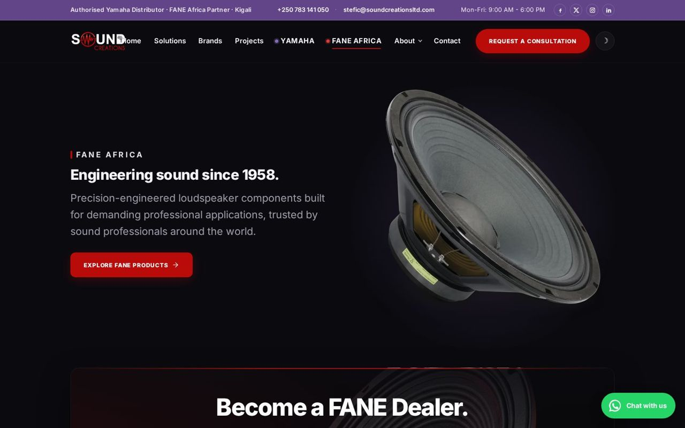 |
| **Solutions** | **Product catalogue with filters** |
| \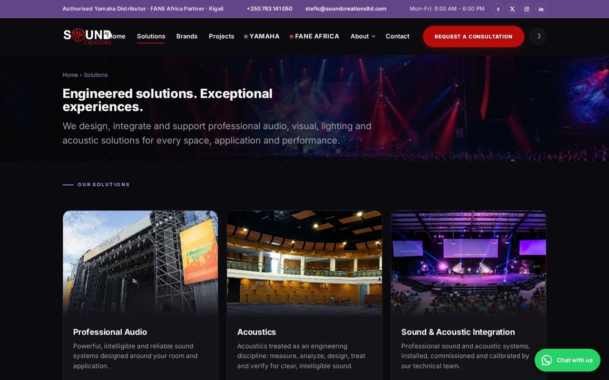 | \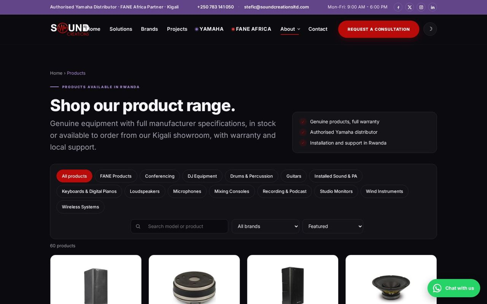 |
| **Projects across Rwanda** | **Project case study (MINECOFIN)** |
| \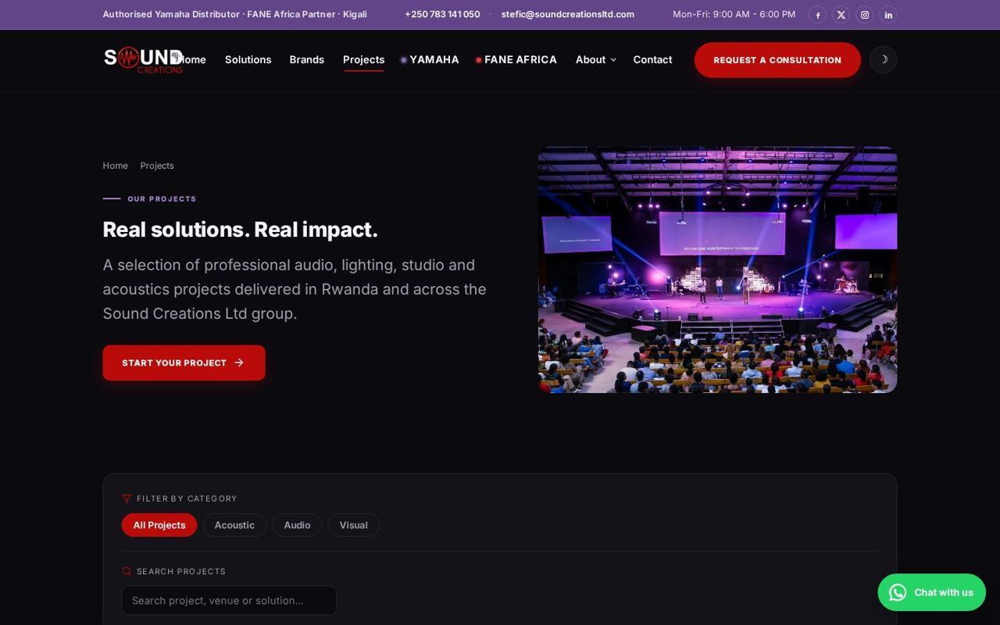 | \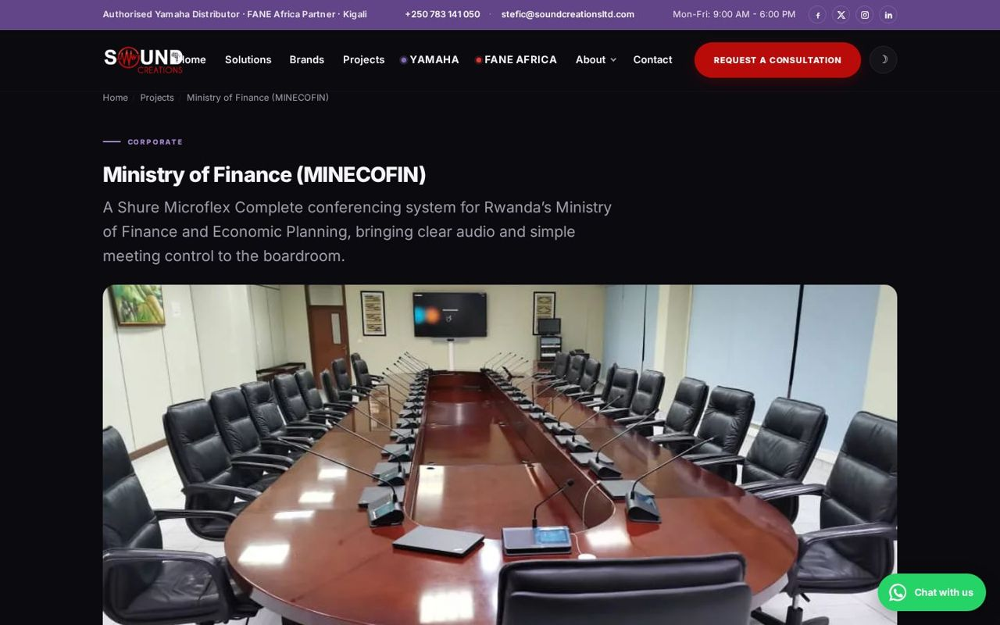 |
| **Partner brands** | **About Sound Creations Rwanda** |
| \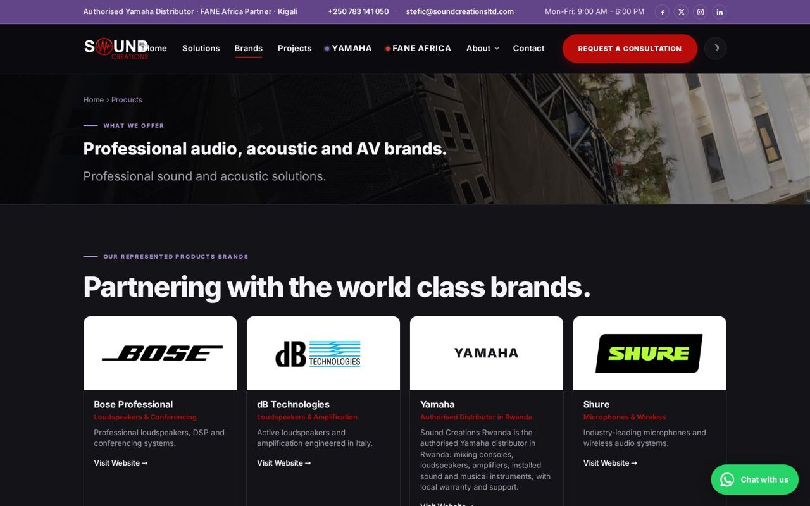 | \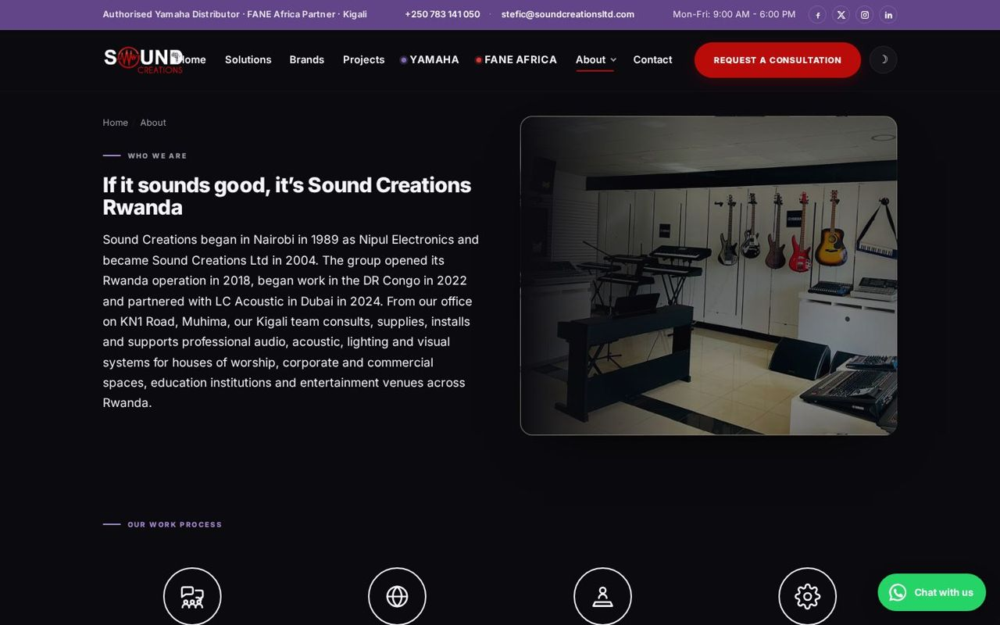 |
| **Contact with both offices** | **Request a consultation** |
| \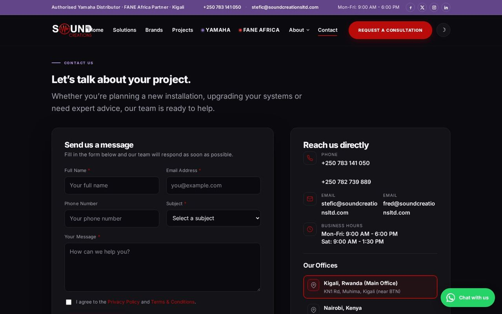 | \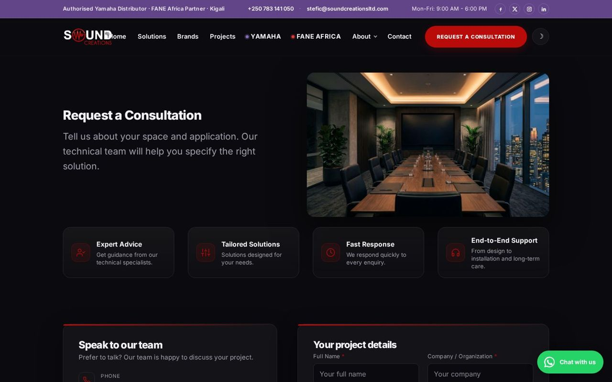 |

| Homepage: what we do | Homepage: projects, clients and stats |
| --- | --- |
| \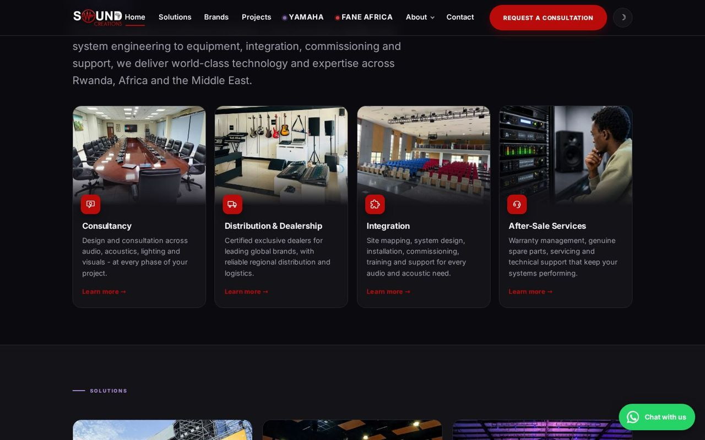 | \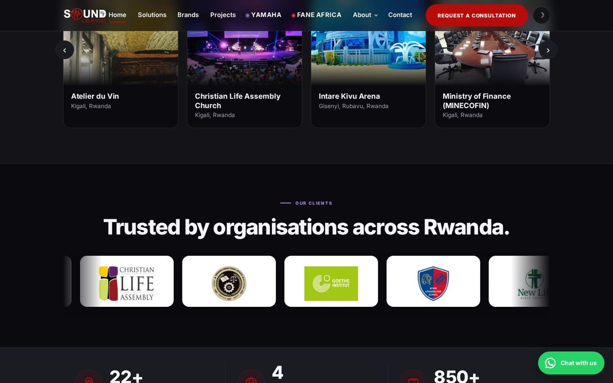 |

### Mobile

<p align="center">
  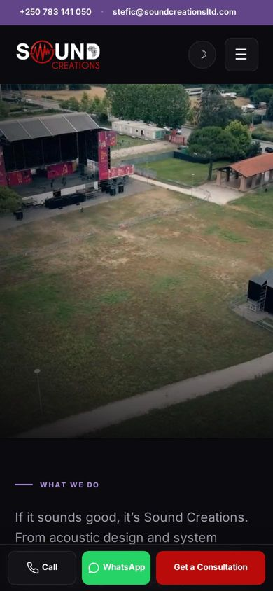
  &nbsp;&nbsp;
  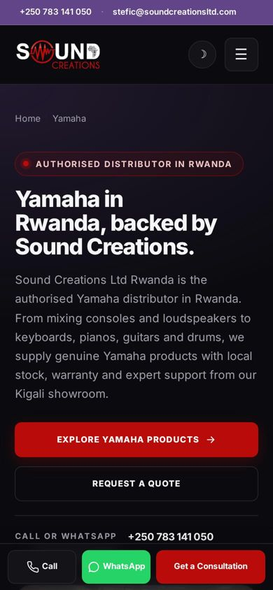
  &nbsp;&nbsp;
  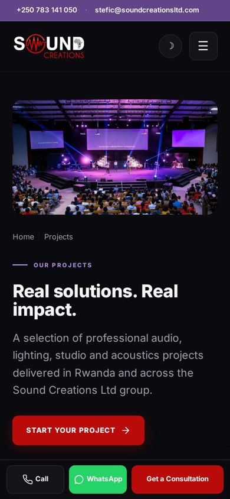
  <br>
  <sub>Mobile-first layout with click-to-call, WhatsApp and consultation shortcuts</sub>
</p>

<sub>Screenshots captured from the live site on 5 October 2026.</sub>

## What the site delivers

### Brands we represent

<p align="center">
  &nbsp;&nbsp;
  &nbsp;&nbsp;
  &nbsp;&nbsp;
  &nbsp;&nbsp;
  &nbsp;&nbsp;
  &nbsp;&nbsp;
  &nbsp;&nbsp;
  
</p>

**Yamaha** leads the line-up as Sound Creations Rwanda is the **authorised Yamaha distributor in Rwanda**, followed by FANE, dB Technologies, Shure, Bose Professional, Allen &amp; Heath, Midas, NEXO, Biamp, Behringer, ChamSys, Asona, Barrisol, Rockfon and more.

### Trusted by organisations across Rwanda

<table>
  <tr>
    <td align="center"></td>
    <td align="center">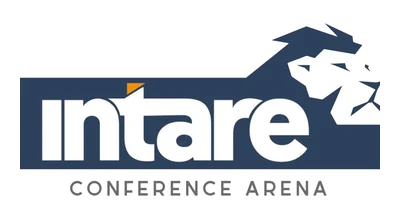</td>
    <td align="center"></td>
    <td align="center">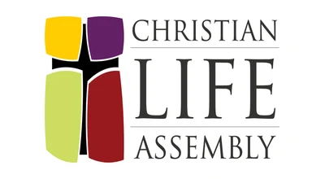</td>
    <td align="center">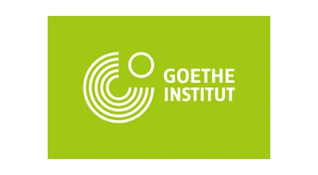</td>
    <td align="center"></td>
  </tr>
</table>

### Key features

**Front end (parent + Rwanda child theme)**
- Dark-first, engineering-led design in brand purple `#624489`, deep purple `#46305F` and action red `#BA0B0B`, with self-hosted Inter and Space Grotesk fonts
- Video hero with a preloaded poster image, light/dark toggle and a one-line desktop menu with **YAMAHA** and **FANE AFRICA** highlighted
- **Yamaha Rwanda hub** (`page-yamaha.php`): showroom, product range, quick call and WhatsApp for both Rwanda lines
- **FANE Africa page**: FANE drivers catalogue, dealer call-to-action and dedicated contact routing
- **Product catalogue** (`archive-sc_product.php`): 55 seeded products with official manufacturer photos, full spec sheets, search, brand and category filters
- **Solutions**: Professional Audio, Architectural Acoustics and Sound &amp; Acoustic Integration, each with Rwanda photos, projects and visible FAQs
- **Services**: Consultancy, Distribution &amp; Dealership, Integration and After-Sale Services
- **Projects** with location filters: MINECOFIN, Intare Kivu Arena, Ntare Louisenlund School, Christian Life Assembly, Atelier du Vin, Romantic Garden, RPF Rubavu Hall
- Header and footer with phone, email, hours, both offices (Kigali and Nairobi), floating WhatsApp chat and a mobile call / WhatsApp / consultation bar
- Rwanda-specific Privacy Policy and Terms &amp; Conditions pages, plus a footer band linking to the group site

**Business tools (plugins)**

| Module | What it does |
| --- | --- |
| **Central settings store** | Phone, email, address, hours, WhatsApp and map link set once in **Sound Creations > Settings**, used everywhere |
| **Content types** | Products, brands, solutions, services, projects, resources and case studies with taxonomies for categories, industries, locations and applications |
| **Enquiry forms** | Consultation, quote, product, dealer, FANE, support and contact forms with conditional fields |
| **Lead routing** | Every enquiry is stored in wp-admin and emailed to `stefic@` and `fred@soundcreationsltd.com` |
| **Spam protection** | Signal-based spam scoring, disposable-domain and MX checks, hashed-IP rate limiting and upload hardening |
| **Self-seeding content** | On activation the Rwanda child fills settings, pages, products, projects, clients and menus, but never overwrites anything an editor has changed |

## Architecture

### How the packages fit together

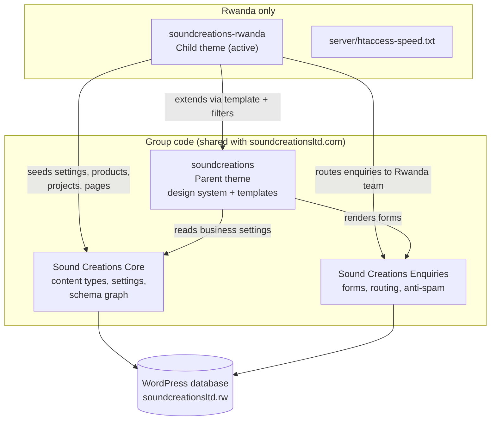
```mermaid
flowchart TB
    subgraph GROUP["Group code (shared with soundcreationsltd.com)"]
        P["soundcreations<br/>Parent theme<br/>design system + templates"]
        CORE["Sound Creations Core<br/>content types, settings,<br/>schema graph"]
        ENQ["Sound Creations Enquiries<br/>forms, routing, anti-spam"]
    end
    subgraph RW["Rwanda only"]
        C["soundcreations-rwanda<br/>Child theme (active)"]
        SV["server/htaccess-speed.txt"]
    end
    C -- "extends via template + filters" --> P
    C -- "seeds settings, products,<br/>projects, pages" --> CORE
    C -- "routes enquiries to Rwanda team" --> ENQ
    P -- "reads business settings" --> CORE
    P -- "renders forms" --> ENQ
    WP[("WordPress database<br/>soundcreationsltd.rw")]
    CORE --> WP
    ENQ --> WP
```

### Request flow: from visitor to sales team

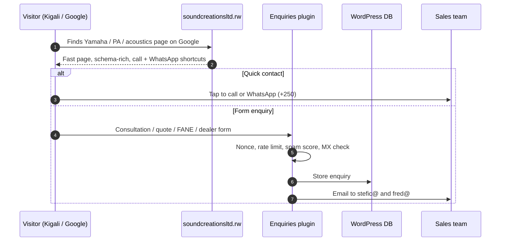
```mermaid
sequenceDiagram
    autonumber
    participant V as Visitor (Kigali / Google)
    participant S as soundcreationsltd.rw
    participant E as Enquiries plugin
    participant DB as WordPress DB
    participant T as Sales team
    V->>S: Finds Yamaha / PA / acoustics page on Google
    S-->>V: Fast page, schema-rich, call + WhatsApp shortcuts
    alt Quick contact
        V->>T: Tap to call or WhatsApp (+250)
    else Form enquiry
        V->>E: Consultation / quote / FANE / dealer form
        E->>E: Nonce, rate limit, spam score, MX check
        E->>DB: Store enquiry
        E->>T: Email to stefic@ and fred@
    end
```

### Rwanda child theme modules

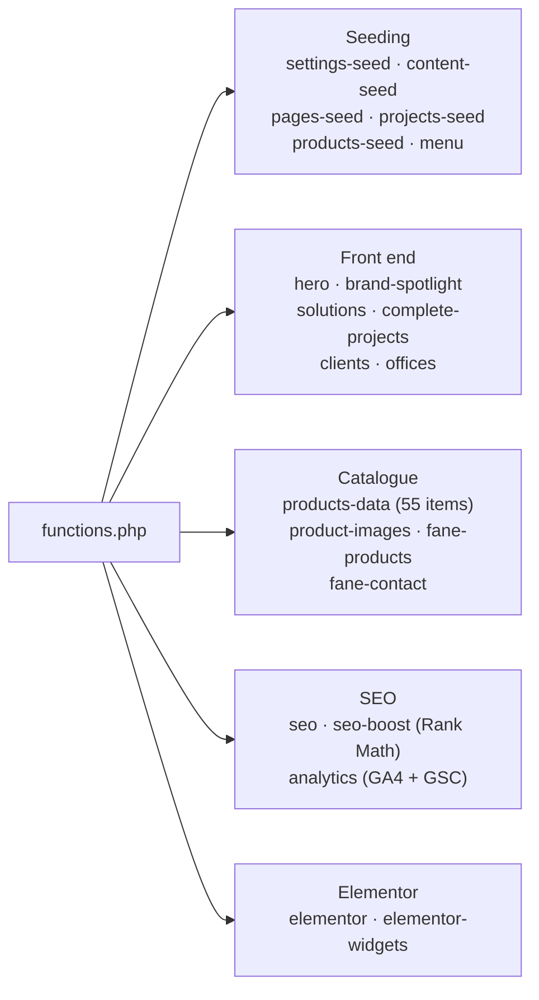
```mermaid
flowchart LR
    F["functions.php"] --> SEED["Seeding<br/>settings-seed · content-seed<br/>pages-seed · projects-seed<br/>products-seed · menu"]
    F --> UI["Front end<br/>hero · brand-spotlight<br/>solutions · complete-projects<br/>clients · offices"]
    F --> CAT["Catalogue<br/>products-data (55 items)<br/>product-images · fane-products<br/>fane-contact"]
    F --> SEO["SEO<br/>seo · seo-boost (Rank Math)<br/>analytics (GA4 + GSC)"]
    F --> EL["Elementor<br/>elementor · elementor-widgets"]
```

### Release pipeline

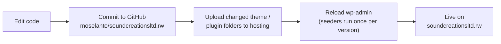
```mermaid
flowchart LR
    A["Edit code"] --> B["Commit to GitHub<br/>moselanto/soundcreationsltd.rw"]
    B --> C["Upload changed theme /<br/>plugin folders to hosting"]
    C --> D["Reload wp-admin<br/>(seeders run once per version)"]
    D --> E["Live on<br/>soundcreationsltd.rw"]
```

> **Deployment note:** commits to this repo do **not** deploy automatically. Upload the changed theme or plugin folders to hosting for updates to go live. Fixes made in the Kenya repository must be ported here deliberately, and vice versa.

## Project structure

```text
.
├── README.md
├── docs/screenshots/                 # README images captured from the live site
├── server/
│   └── htaccess-speed.txt            # Compression + 1-year browser caching rules
├── soundcreations/                   # Parent theme (copied from the Kenya repo)
│   ├── front-page.php                # Homepage: hero, what we do, solutions, projects, clients
│   ├── archive-sc_*.php              # Brands, projects, resources, solutions archives
│   ├── single-sc_*.php               # Brand, product, project, resource, service, solution
│   ├── page-about.php  page-fane.php  page-contact.php  page-request-a-consultation.php
│   ├── template-elementor.php        # Full-width Elementor layout with site header/footer
│   ├── template-parts/               # Contact and consultation page parts
│   ├── inc/                          # setup, enqueue, customizer, shortcodes,
│   │                                 # template-tags, hardening (security headers)
│   ├── assets/{css,js,fonts,img}/    # tokens.css, main.css, theme.js, Inter + Space Grotesk
│   └── theme.json  style.css  functions.php
├── soundcreations-rwanda/            # Child theme (Rwanda only, ACTIVATE THIS)
│   ├── page-yamaha.php               # Yamaha Rwanda hub
│   ├── archive-sc_product.php        # Product catalogue with search and filters
│   ├── inc/                          # Seeders, hero, solutions, products, SEO, analytics, Elementor
│   ├── assets/img/                   # Rwanda photos, clients, products, projects (WebP)
│   └── style.css  functions.php
├── sound-creations-core/             # Plugin: content types, settings, schema, setup wizard
│   └── includes/                     # post-types, taxonomies, fields, settings, seo-graph,
│                                     # seo-titles, seo-faq, seed-catalog, security
└── sound-creations-enquiries/        # Plugin: B2B enquiry system
    └── includes/                     # forms, handler, antispam, security, mail, admin
```

The Kenya child theme (`soundcreations-child/`) is deliberately not included.

## Content model

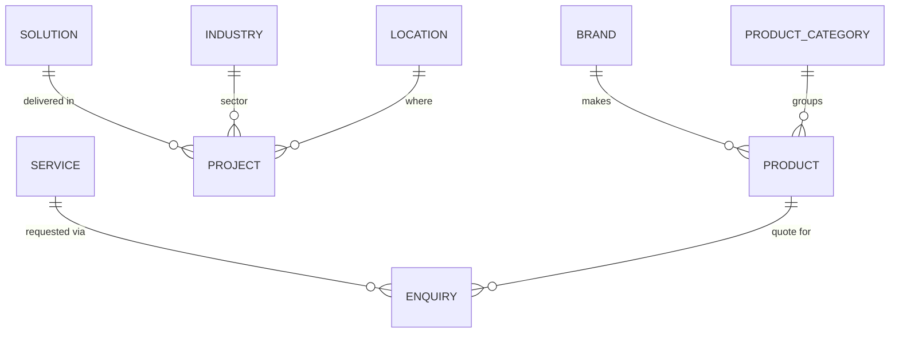
```mermaid
erDiagram
    BRAND ||--o{ PRODUCT : makes
    PRODUCT_CATEGORY ||--o{ PRODUCT : groups
    SOLUTION ||--o{ PROJECT : "delivered in"
    INDUSTRY ||--o{ PROJECT : "sector"
    LOCATION ||--o{ PROJECT : "where"
    SERVICE ||--o{ ENQUIRY : "requested via"
    PRODUCT ||--o{ ENQUIRY : "quote for"
```

| Post type | Purpose | Taxonomies |
| --- | --- | --- |
| `sc_product` | Catalogue item with specs, photos and manufacturer link | `sc_product_category`, `sc_brand_tax` |
| `sc_brand` | Partner brand page and logo | - |
| `sc_solution` | Professional Audio, Acoustics, Integration | `sc_solution_area` |
| `sc_service` | Consultancy, Distribution, Integration, After-Sale | - |
| `sc_project` | Installation case study | `sc_project_type`, `sc_industry`, `sc_location`, `sc_application` |
| `sc_resource` / `sc_case_study` | Videos, downloads and long-form stories | - |
| `sc_enquiry` | Private store of form submissions | - |

## SEO and structured data

Built to rank for local searches such as *audio visual Rwanda, sound systems Kigali, PA system Kigali, Yamaha Rwanda, acoustic treatment Rwanda, stage lighting Kigali, church sound system Rwanda* and *conference room AV Kigali*.

- **Rank Math owns the `<head>`** (title, description, canonical, robots). The theme keeps one connected JSON-LD graph and Rank Math's own schema is switched off so the two never contradict each other. Anything typed into Rank Math always wins.
- **Keyword-targeted Kigali / Rwanda titles** for every page type: Yamaha, FANE, brands, products, solutions and projects.
- **Schema graph** with `Organization`, `LocalBusiness` (KN1 Rd, Muhima, Kigali), `WebSite` + `SearchAction`, `BreadcrumbList`, `Product` + `Offer`, `Brand`, `Service`, `OfferCatalog`, `FAQPage`, `VideoObject`, `ItemList` and `OpeningHoursSpecification`, linked to the group with `parentOrganization` and `areaServed` covering Rwanda's cities, the DRC and East Africa.
- Kigali geo meta, WordPress XML sitemap at `/wp-sitemap.xml`, and GA4 and Search Console fields under **Settings > General**.

| Checklist | Status |
| --- | --- |
| Location-targeted titles, service copy and schema | Done |
| Internal links to the group site | Done |
| Rank Math integration and FAQ schema | Done |
| Google Business Profile for KN1 Rd, Muhima (same name, address and phone) | Pending |
| Search Console verified and `/wp-sitemap.xml` submitted | Pending |
| GA4 property and baseline report | Pending |
| Link from soundcreationsltd.com (Kigali branch / contact page) | Pending |
| Legal review of Rwanda Privacy and Terms pages | Pending |

## Performance and security

- **Performance:** WebP images (under 200 KB, set dimensions), preloaded hero poster for LCP, unused WordPress block CSS removed on the front end, self-hosted fonts, deferred vanilla JavaScript, plus `server/htaccess-speed.txt` for Gzip/Deflate and one-year browser caching on LiteSpeed or Apache.
- **Security:** escaped output and sanitised input, nonce-protected forms, security headers (`X-Frame-Options`, `Referrer-Policy`, `Content-Security-Policy` frame-ancestors, HSTS on HTTPS), hashed-IP rate limiting and upload hardening in the enquiry plugin.
- **Accessibility:** skip-to-content link, one H1 per page, keyboard-friendly menus and descriptive alt text on all images.

## Requirements

| Component | Version |
| --- | --- |
| WordPress | 6.4 or later |
| PHP | 8.0 or later |
| HTTPS | Required |
| Recommended | Rank Math SEO, Elementor (free is enough; Pro adds the theme builder) |
| Hosting | LiteSpeed or Apache with `mod_deflate` and `mod_expires` |

## Deployment

1. Back up the current Rwanda site (files and database).
2. Install a clean WordPress (6.4+, PHP 8.0+, HTTPS) on soundcreationsltd.rw.
3. Upload `soundcreations/` and `soundcreations-rwanda/` to `wp-content/themes/`.
4. Upload `sound-creations-core/` and `sound-creations-enquiries/` to `wp-content/plugins/`.
5. Activate **Sound Creations Core**, then **Sound Creations Enquiries**.
6. Activate the **Sound Creations Rwanda** theme. Settings, pages, products, projects and legal pages seed automatically; reload wp-admin once.
7. **Settings > Permalinks** > Save.
8. **Settings > General**: Site Title `Sound Creations Ltd Rwanda`, timezone Kigali, then the GA4 ID and Search Console code.
9. Upload the site icon (**Appearance > Customize > Site Identity**); the schema uses it as the logo.
10. Paste the block from `server/htaccess-speed.txt` at the top of `public_html/.htaccess` (keep a backup of the original first).

## Editing pages with Elementor

### Setup (once)

1. **Plugins > Add New**, search **Elementor**, install and activate.
2. Reload wp-admin once. The theme then automatically:
   - sets the Elementor Site Kit to the brand: purple `#624489`, deep purple `#46305F`, action red `#BA0B0B`, Inter typography, 1180px content width;
   - turns off Elementor's default colours, fonts and Google Fonts (Inter is served locally, which is faster);
   - enables Elementor on Pages, Posts, Solutions, Projects and Services.

### Editing a page

- Open any page and click **Edit with Elementor**.
- An Elementor-built page switches to a full-width layout that keeps the site header and footer. Switch back to the normal editor and the original design returns.
- Elementor's **Canvas** and **Full Width** templates are respected if chosen under Page Settings.

### Sound Creations widgets

| Widget | What it shows |
| --- | --- |
| SC Contact Card | Phone, email, address, hours and WhatsApp button from **Sound Creations > Settings** |
| SC Enquiry / Quote Form | The spam-protected enquiry system (quote, consultation, contact, support, dealer) |
| SC Projects Grid | Latest projects, optionally filtered by location (e.g. "Rwanda") |
| SC Brands &amp; Partners | The partner logo strip from Brands |
| SC Call-to-Action Band | Branded CTA band with heading, text, button and optional background photo |

Change a phone number once in **Sound Creations > Settings** and every page using these widgets updates.

### Good practice

- Use the Site Kit colours and fonts rather than custom colours, so pages stay on brand.
- Keep images under about 200 KB (WebP preferred) and always fill in alt text.
- Use one H1 per page, then H2/H3 for sections.
- Save good sections as Elementor templates to reuse across pages.

## Still needed from the Rwanda team

- More Rwanda projects (add as **Projects** with a location such as `Kigali, Rwanda`).
- Further client names and logos cleared for publication.
- Rwanda-specific brand or partner logos (add under **Brands**), including an official Yamaha logo at `soundcreations/assets/img/brands/logos/yamaha.png`.
- Rwanda social media links if separate from the group accounts.
- Kigali office latitude/longitude for map schema (left blank rather than guessed).

## Business

**Sound Creations Ltd Rwanda**
KN1 Rd, Muhima, Kigali, Rwanda
Phone: [+250 783 141 050](tel:+250783141050) · [+250 782 739 889](tel:+250782739889)
Email: [stefic@soundcreationsltd.com](mailto:stefic@soundcreationsltd.com) · [fred@soundcreationsltd.com](mailto:fred@soundcreationsltd.com)
Hours: Mon - Fri 9:00 AM - 6:00 PM · Sat 9:00 AM - 1:30 PM · Sun closed (Kigali time)

Part of the **Sound Creations Ltd** group: [soundcreationsltd.com](https://soundcreationsltd.com/) (Nairobi, Kenya).

## Credits

Designed, developed and maintained by **[Pimofy Digital](https://github.com/moselanto)**, Nairobi.
Fonts: Inter and Space Grotesk (SIL Open Font License). Product images and trademarks belong to their respective manufacturers.

## License

GNU General Public License v2 or later. See the [license text](http://www.gnu.org/licenses/gpl-2.0.html).

<div align="center"><sub><i>If it sounds good, it's Sound Creations.</i></sub></div>
